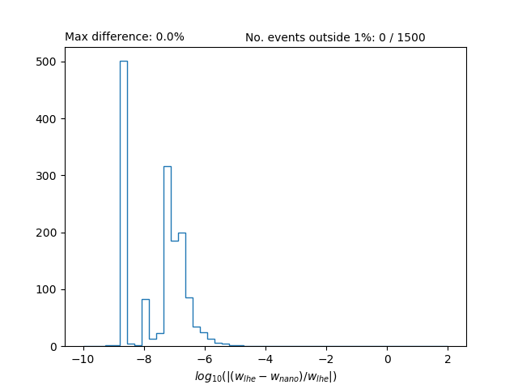
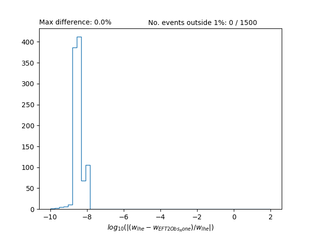

# Validation

To validate the reweighting for a particular process, we will need an LHE file of events which contains reweights produced during the MC production (which we know are correct). This LHE file can be converted to NanoAOD format. Full simulation is not neccessary for validation so we can use [NanoGen](https://twiki.cern.ch/twiki/bin/viewauth/CMS/NanoGen) which is NanoAOD containing only gen-level information. Once we have the events in NanoAOD format then we can follow the normal steps to perform the reweighting and compare the standalone reweights with the ones given in the LHE file. 

## Producing the LHE file

The original LHE file containing the reweights can be made with the help of EFT2Obs (although it need not be if you are more familiar with a different way). Here, we will validate the reweighting shown in the [walkthrough example](walkthrough.md). Follow step 1 of the [walkthrough example](walkthrough.md). Now we make the gridpack for this process:

```
./scripts/make_gridpack.sh ggF-SMEFTsim
```
and then produce the LHE file with:
```
python scripts/run_gridpack.py --gridpack gridpack_ggF-SMEFTsim.tar.gz -s 1 -e 500 --save-lhe . --to-step lhe
gunzip events_1.lhe.gz
mv events_1.lhe path/to/events.lhe
```

## Running validation

An all-in-one script has been written that given the LHE file and a reweighting module will convert the LHE to NanoGen and then output a collection of graphs that can be used for validation. To use this script, move into the validation directory:
```
cd validation
```
and do:
```
./scripts/validate_in_one.sh path/to/events.lhe 500 path/to/rw_module LHE path/to/plots_dir
```

<details>
<summary>Breakdown of the steps.</summary>
<p>

Set variables for LHE->NanoGen
```sh
LHE_PATH=path/to/input.lhe
NEVENTS=10
EDM_PATH=edm.root
NANOGEN_PATH=nanogen.root
```

LHE -> EDM
```sh
cmsDriver.py --python_filename lhe_edm.py --eventcontent LHE --datatier LHE \
    --fileout file:$EDM_PATH --conditions auto:mc --step NONE --filein file:$LHE_PATH \
    --no_exec --mc -n $NEVENTS
cmsRun lhe_edm.py
```

EDM -> NanoGen
```sh
cmsDriver.py PhysicsTools/NanoAODTools/python/postprocessing/modules/reweighting/hadronizer.py \
    --filein file:$EDM_PATH --fileout $NANOGEN_PATH --mc --eventcontent NANOAODGEN \
    --datatier NANOAODSIM --conditions auto:mc --step GEN,NANOGEN --nThreads 1 \
    --python_filename edm_nano.py --no_exec -n $NEVENTS \
    --customise PhysicsTools/NanoAOD/nanogen_cff.pruneGenParticlesNano
cmsRun edm_nano.py
```

Set
```sh
RW_PATH=path/to/rw_module
PLOTS_DIR=plots
EFT2OBS_PKL_PATH=eft2obs.pkl
```

Apply reweighting
```sh
python ../scripts/run_reweighting.py . $NANOGEN_PATH $RW_PATH
```

Run EFT2Obs Check
```sh
python scripts/eft2obs_only_test.py $LHE_PATH $RW_PATH $EFT2OBS_PKL_PATH
```
Run NanoAOD check and produce plots
```sh
python scripts/validate_nano.py $EFT2OBS_PKL_PATH ${NANOGEN_PATH}_Skim $PLOTS_DIR
``` 

</p>
</details>

## Interpreting the plots

The plots are all histograms of the log fractional differences between sets of weights. The most important plot is the named `lhe_nano.png`. If you followed the above instructions you should find a graph similar to this:



This graph shows that the majority of the weights calculated via the standalone reweighting agree very well (within $10^-5$) with the reweights calculated during generation. 

The next plot, named `lhe_EFT2Obs_none.png` compares weights calculated with the EFT2Obs interface alone. This is done by reading the original LHE directly rather than converting to NanoGen and using nanoAOD-tools. If this plot shows that weights are agreeing then you know that the reweighting works **provided the correct information** is fed in. Therefore, this plot may be useful for debugging purposes.



There are more plots that may be useful:
- `lhe_EFT2Obs_<n>.png` shows you what the agreement would look like if you rounded the numbers in the LHE file to n decimal places.
- `lhe_nano_rw_<n>.png` shows the agreement when looking at one particular reweighting point only (the nth point)
- `comparison_<n>.png` is a combination of `lhe_nano.png` and `lhe_EFT2Obs_<n>.png`
